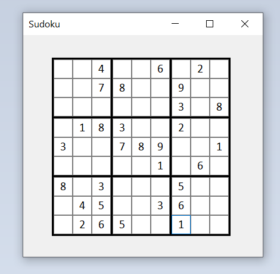

# Sudoku

El objetivo de este proyecto era el de ayudar a las personas que estuvieran trabadas con un Sudoku y que no pudieran completarlo. La idea era que completen algunos de los casilleros en blanco y que aprentando un boton el programa muestre que casillero se puede completar utilizando alguna de las técnicas mencionadas en esta página: https://www.learn-sudoku.com/basic-techniques.html

Pero decidí abandonar el proyecto porque empecé a tener muchos problemas con la interfaz de WinForms. Creo que el principal motivo era que tenía 81 elementos en la GUI (los 81 casilleros) y que por esta razón se volvió muy inestable y poco responsive. Además, empecé a tener problemas al guardar los archivos. Habia veces que después de trabajar un archivo no podía guardarlo, por lo que tenía que cerrar el Visual Studio, volverlo a abrir y copiar los cambios que había hecho. Algo bastante molesto y que no me había sucedido nunca trabajando en otros proyectos.
